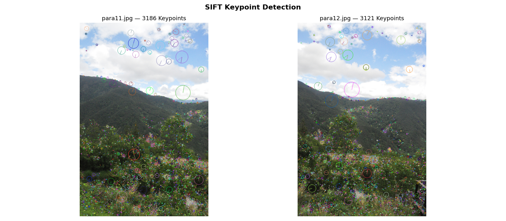
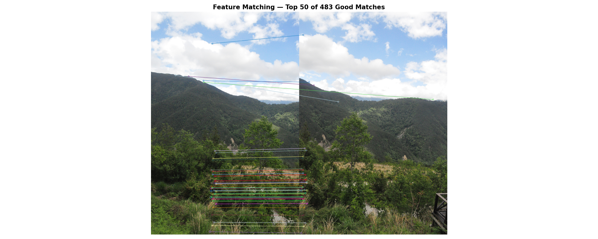
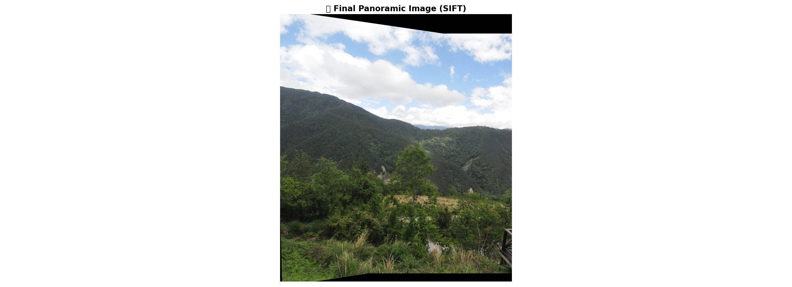

# 🌄 Pano-Vision

Combine two partially overlapping images into a single panoramic 
view using the **SIFT algorithm** and OpenCV.

## 📌 How It Works

| Step | Description |
|------|-------------|
| 1 | Load two overlapping images |
| 2 | Detect keypoints using SIFT |
| 3 | Match features using BFMatcher + Lowe's ratio test |
| 4 | Compute Homography using RANSAC |
| 5 | Warp & stitch with gradient blending |
| 6 | Auto-crop black borders |

## 🖼️ Results

### Input Images
| para11.jpg | para12.jpg |
|---|---|
| Left view | Right view |

### SIFT Keypoints Detected

### Feature Matches

### Final Panorama

## 📊 Statistics
- Keypoints detected (img1): **3186**
- Keypoints detected (img2): **3121**
- Good matches (Lowe's test): **483**
- RANSAC inliers: **461 / 483 (95.4%)**

## 🛠️ Tech Stack
- Python
- OpenCV (SIFT, BFMatcher, RANSAC)
- NumPy
- Matplotlib

## 📁 Project Structure
PANO-VISION/
├── images/          ← input images
│   ├── para11.jpg
│   └── para12.jpg
├── output/          ← generated results
│   ├── keypoints.png
│   ├── matches.png
│   └── panorama.png
├── src/
│   └── stitch.py    ← main pipeline
└── requirements.txt

## 🚀 Run
pip install -r requirements.txt
python src/stitch.py